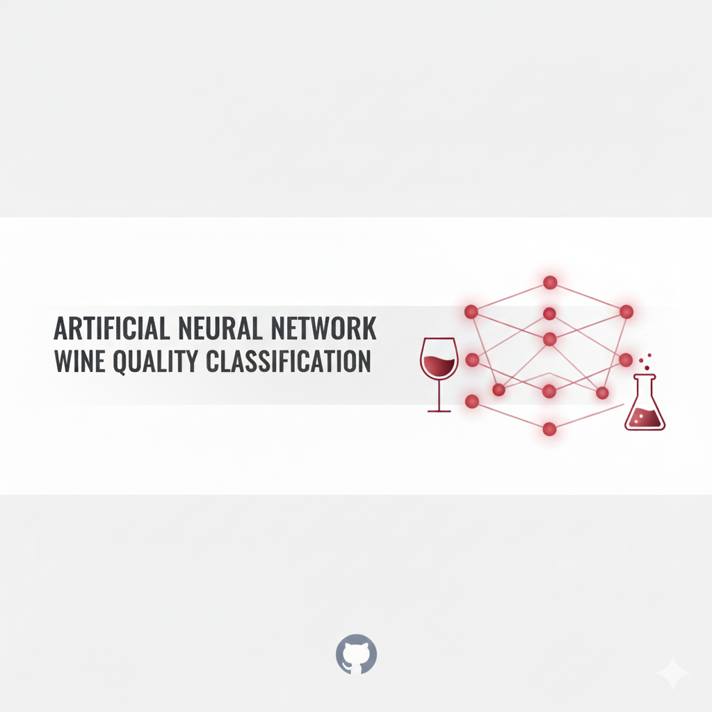

  

Wine Quality Classification using Artificial Neural Networks (ANN)

This project implements a lightweight Artificial Neural Network to classify wine samples as Good or Bad based on their physicochemical properties. The model is trained on the WineQT dataset and follows a complete machine learning workflow including preprocessing, model training, evaluation, and result visualization.
The entire implementation is contained in a single Jupyter Notebook (ANN.ipynb) supported by one dataset file (WineQT.csv).

Project Files
ANN.ipynb        - Notebook containing the complete ANN workflow
WineQT.csv       - Dataset used for training and evaluation
banner.png       - Optional project banner for GitHub
README.md        - Documentation

Project Overview

The objective of this project is to build an ANN that predicts whether a wine sample is of good quality. The dataset provides several chemical attributes such as acidity, alcohol content, sulphates, pH, and density. The target variable quality is converted into a binary label:

1 → Good quality (quality score ≥ 6)

0 → Bad quality (quality score < 6)

The neural network is trained on these features to learn the patterns associated with wine quality classification.

Dataset Description

WineQT.csv contains the following attributes:

fixed acidity

volatile acidity

citric acid

residual sugar

chlorides

free sulfur dioxide

total sulfur dioxide

density

pH

sulphates

alcohol

quality (numeric target that is later binarized)

Missing values, if present, are removed using a basic cleaning step.

Model Architecture

The ANN implemented in the notebook uses the following architecture:

Input Layer: 12 features

Hidden Layer 1: 12 neurons, ReLU activation

Hidden Layer 2: 8 neurons, ReLU activation

Output Layer: 1 neuron, Sigmoid activation

Loss Function: Binary Crossentropy

Optimizer: Adam

Metrics: Accuracy

Training: 50 epochs, batch size 32, 20% validation split

This architecture provides a balance between simplicity and classification performance.

Steps Followed in the Notebook
1. Data Loading

The dataset is imported using pandas and viewed for initial understanding.

2. Data Cleaning

Missing values are checked and dropped using dropna().

3. Label Transformation

The quality column is converted into a binary label called quality_label depending on the specified threshold.

4. Feature Scaling

Standardization is applied using StandardScaler to normalize all continuous variables.

5. Train-Test Split

The data is split into training and test sets using an 80:20 ratio.

6. ANN Model Creation

A Sequential neural network is defined with ReLU activation in hidden layers and a sigmoid output layer.

7. Model Training

The model is trained for 50 epochs with validation on a portion of the training data.

8. Model Evaluation

The notebook computes:

Accuracy

Confusion matrix

Classification report

Training curves for accuracy and loss

9. Forward and Backward Pass Demonstration

The notebook includes additional educational sections illustrating:

Manual forward pass

Gradient computation using tf.GradientTape()
These help explain how ANN training works internally.

How to Run This Project

Install required packages:

pip install numpy pandas scikit-learn tensorflow matplotlib seaborn

Run the notebook:

Open ANN.ipynb in Jupyter Notebook or VS Code and execute cells sequentially.

Results will display directly in the notebook, including accuracy, loss plots, predictions, and performance metrics.

Future Enhancements

Add additional hidden layers or use regularization (Dropout, Batch Normalization)

Tune hyperparameters such as learning rate, number of neurons, and activation functions

Expand classification to multi-class (predict actual quality score rather than binary label)

Deploy the trained model as a web application (Flask, FastAPI, or Streamlit)

Compare ANN with other algorithms such as Random Forest, SVM, or XGBoost

